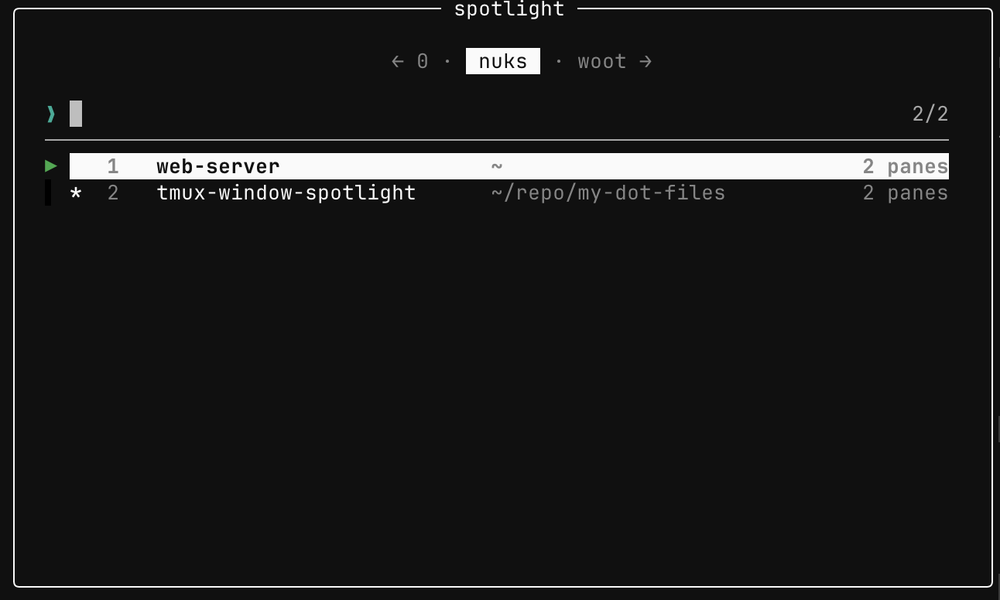

# tmux-spotlight

`prefix + w` opens a popup listing your windows, and filters them as you type.



Matching is fuzzy, against the window index and name: `mlw` finds
`my long window`, `3` jumps to window 3.

The cursor starts on the active window, the one marked `*`.

## Keys

| Key | Action |
| --- | --- |
| `Enter` | switch to the window |
| `Esc` | close |
| `←` `→` | browse another session |
| `↑` `↓` | move the cursor |

## Sessions

The strip at the top lists every session. `←` and `→` move along it and the
list follows, so your search only ever matches windows in the highlighted one.
The query carries over when you move, so `→` means "look for it in the next
session". Picking a window elsewhere switches session and window together.

With one session there is no strip.

Since `←` and `→` browse sessions, they no longer move the cursor inside your
query. `Ctrl-b` and `Ctrl-f` do.

## Install

Needs tmux 3.2+ and [fzf](https://github.com/junegunn/fzf).

With [TPM](https://github.com/tmux-plugins/tpm), add to `~/.tmux.conf` and
press `prefix + I`:

```tmux
set -g @plugin 'humbledshuttler/tmux-spotlight'
```

Or clone it anywhere and add:

```tmux
run-shell /path/to/tmux-spotlight/spotlight.tmux
```

## Options

Set these before the plugin loads.

| Option | Default | What it does |
| --- | --- | --- |
| `@spotlight-key` | `w` | key after the prefix |
| `@spotlight-context` | `path` | second column: `path`, `command`, `both`, `none` |
| `@spotlight-extra-rows` | `4` | blank rows kept under the list |
| `@spotlight-width` | fits content | cells or a percentage |
| `@spotlight-height` | fits content | cells or a percentage |
| `@spotlight-colors` | cyan matches | fzf `--color` spec |
| `@spotlight-border` | `rounded` | any `popup-border-lines` value |
| `@spotlight-title` | `spotlight` | popup title |
| `@spotlight-preview` | `off` | `on` previews the highlighted window's pane |
| `@spotlight-preview-position` | `right:50%` | fzf `--preview-window` position |

```tmux
set -g @spotlight-key 'Space'
set -g @spotlight-preview 'on'
set -g @plugin 'humbledshuttler/tmux-spotlight'
```

The popup is sized to fit: as tall as your biggest session's window list, as
wide as the longest row, up to 80% of the terminal's height and 90% of its
width. Set `@spotlight-width` / `@spotlight-height` if you'd rather pick.

## Tests

```sh
tests/run.sh
```

Runs its own tmux server on a separate socket with `-f /dev/null`, so it
leaves your sessions and config alone. A few tests skip without fzf.

## License

MIT
